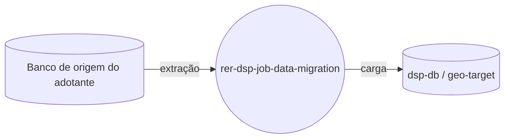

# rer-dsp-job-data-migration

> Este repositório é um dos módulos do **DSP (Data Sharing Platform)**, parte do ecossistema RER.
> A documentação completa do projeto está em **[rer-dsp-docs](https://github.com/Rural-Environmental-Registry/rer-dsp-docs)**.
> As informações abaixo tratam apenas deste módulo, não do projeto DSP como um todo.

## Qual parte do DSP este módulo é



## Objetivo

ETL baseado em Spring Batch que migra dados geoespaciais do banco de origem do adotante
para os bancos do DSP.

## Responsabilidades

- Extrair dados geoespaciais da fonte do adotante
- Transformar e validar as feições migradas
- Carregar (UPSERT) os dados nos bancos do DSP (`target` e `geo-target`)

## Tecnologias

Java 21, Spring Boot 3.4.2, Spring Batch, PostgreSQL/PostGIS, Maven.

## Como executar

```bash
./mvnw spring-boot:run
```

Ou, preferencialmente, via `rer-dsp-core` (`./setup.sh`), que orquestra a stack completa.

## Licença

[GNU General Public License v3.0](LICENSE)
